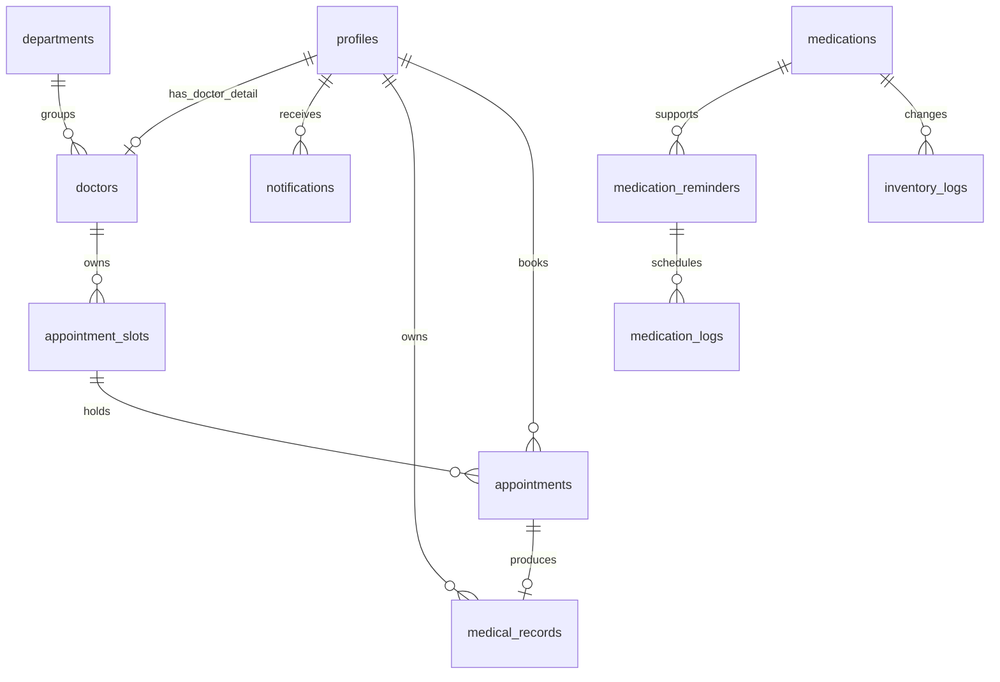

# 03. แบบข้อมูลและ ER

ปรับปรุง 7 กันยายน 2569 (2026-09-07) — เอกสารนี้ยึดตาม schema snapshot ล่าสุดที่ส่งมา ซึ่งมี 11 ตารางหลัก, 3 roles และฟิลด์ contract ที่ใช้งานอยู่จริงในแบบข้อมูล

> ไฟล์ schema snapshot จาก Supabase เป็นข้อมูลอ้างอิง ไม่ควรรันตรง ๆ เพราะไม่มีลำดับ Foreign Key ที่รับประกันได้ ให้ใช้ `supabase/migrations/01_schema.sql` สำหรับฐานใหม่ หรือ `supabase/migrate_existing_schema_preserve_data.sql` สำหรับฐานเดิมที่ต้องรักษาข้อมูล

## สถานะและขอบเขต

- Runtime เป้าหมายใช้ Supabase จริงผ่าน database repository; mock repository สงวนไว้สำหรับ automated tests และ offline demo ที่ระบุชัด
- Schema ปัจจุบันมี 11 ตาราง: `profiles`, `departments`, `doctors`, `appointment_slots`, `appointments`, `medical_records`, `medications`, `inventory_logs`, `medication_reminders`, `medication_logs`, `notifications`
- บทบาทใน `profiles.role` เหลือ 3 ค่าเท่านั้น: `patient`, `medical`, `staff_admin`
- `medical` ครอบคลุมแพทย์และเภสัชกร; `staff_admin` ครอบคลุมเจ้าหน้าที่และแอดมิน
- ตาราง normalized รุ่นเก่า เช่น `reschedule_proposals`, `prescription_items`, `dispensing_items`, `stock_reservations`, `email_jobs` และ `broadcasts` ไม่อยู่ใน scope ปัจจุบัน
- คอลัมน์ compatibility ที่ยังอยู่ใน 11 ตารางไม่ใช่หลักฐานว่าเปิดใช้ workflow เก่าแล้ว

## RLS สำหรับค้นหาผู้ป่วย

ผู้ใช้ role `medical` และ `staff_admin` อ่านข้อมูลใน `profiles` ของผู้ป่วยได้ เพื่อใช้หน้าค้นหาผู้ป่วย ส่วนผู้ใช้ role `patient` อ่านได้เฉพาะ profile ของตนเองตาม policy เดิม การแก้ policy สำหรับฐานเดิมอยู่ใน `supabase/migrations/08_allow_medical_patient_search.sql`:

```sql
DROP POLICY IF EXISTS "Staff/Admin can view all profiles" ON public.profiles;
DROP POLICY IF EXISTS "Staff admin and medical can view profiles" ON public.profiles;

CREATE POLICY "Staff admin and medical can view profiles"
  ON public.profiles FOR SELECT
  USING (public.get_user_role() IN ('staff_admin', 'medical'));
```

ต้องรัน migration นี้บนฐาน development/staging หรือฐาน runtime ที่ตรวจสอบ target แล้วก่อนอ้างว่าการค้นหาผู้ป่วยผ่าน RLS ทำงานจริง เอกสารและ migration ใน repository ยังไม่ใช่หลักฐานว่า deploy แล้ว

## Role contract

| ลำดับ | บทบาท | ค่าใน `profiles.role` | ขอบเขตหลัก |
| --- | --- | --- | --- |
| 1 | ผู้ป่วย | `patient` | โปรไฟล์ นัด รายการเตือน และข้อมูลของตน |
| 2 | แพทย์/เภสัชกร | `medical` | ตรวจรักษา บันทึกผล และจัดการยาตามหน้าที่ |
| 3 | เจ้าหน้าที่/แอดมิน | `staff_admin` | จัดการบัญชี แผนก slot นัดหมาย รายการเตือน Dashboard และ Broadcast |

นักศึกษา/บุคลากรเป็น `patient_type` ไม่ใช่ role เพิ่ม และผู้ใช้หนึ่งบัญชีมี role เดียว

## ตารางใน scope ปัจจุบัน

| ตาราง | หน้าที่และความสัมพันธ์ | ข้อจำกัดหลัก |
| --- | --- | --- |
| `profiles` | บัญชีผู้ใช้ ขยายจาก `auth.users` | role ต้องเป็น 3 ค่า canonical |
| `departments` | แผนกการรักษา | ปิดใช้งานด้วย `is_active` โดยไม่ลบประวัติ |
| `doctors` | รายละเอียดแพทย์ที่เป็นบัญชี `medical` | ผูกกับ `profiles` และ `departments` |
| `appointment_slots` | รอบเวลาตรวจของแพทย์ | status คือ `available`, `full`, `closed` |
| `appointments` | การนัดของผู้ป่วยกับ slot | ผูกผู้ป่วยและ slot; ไม่มี auto-reschedule/auto-no-show |
| `medical_records` | ผลตรวจและรายการยาแบบ JSONB | ผูกนัด ผู้ป่วย และแพทย์ |
| `medications` | Catalog และยอดคลังยา | ยอด stock ใช้ประกอบการจ่ายยา |
| `inventory_logs` | ประวัติรับเข้า ปรับยอด และจ่ายยา | เก็บผู้ทำรายการและจำนวน |
| `medication_reminders` | รายการเตือนยาของผู้ป่วย | ไม่มี worker หรือ email อัตโนมัติ |
| `medication_logs` | ผลการบันทึกกินยาแต่ละรายการ | ผู้ป่วยกดบันทึกเอง ไม่เปลี่ยนตามเวลา |
| `notifications` | กล่องข้อความรายผู้ใช้ | ผู้รับเป็นเจ้าของข้อมูลของตน |

ข้อมูลตัวอย่างล่าสุดที่ส่งมามี 4 แผนกใน `departments` และ 8 รายการยาใน `medications`; การปรับ schema ไม่ลบหรือเปลี่ยนข้อมูลสองตารางนี้

## ER ปัจจุบัน



สัญลักษณ์ใน ER อธิบายความสัมพันธ์เชิงแบบจำลอง ไม่ได้สั่งให้ระบบสร้างข้อมูลอัตโนมัติ เช่น ผลตรวจควรมีได้ไม่เกินหนึ่งรายการต่อนัดตาม domain rule แต่ snapshot ไม่ได้ประกาศ UNIQUE ของ `medical_records.appointment_id`

## Data dictionary ฉบับตรงกับ schema ล่าสุด

ชนิดข้อมูล, ค่า NULL, default และ FK ด้านล่างยึดตาม schema snapshot ล่าสุดที่ส่งมา. ฟิลด์ compatibility ยังบันทึกไว้เพื่อไม่ให้ข้อมูลเดิมหาย แต่ไม่มี workflow เก่ารองรับใน scope นี้

### 1. `profiles`

| ฟิลด์ | Type | NULL | Default | Key / constraint | ความหมาย |
| --- | --- | --- | --- | --- | --- |
| `id` | `uuid` | ไม่ได้ | — | PK; FK → `auth.users.id` | รหัสบัญชีเดียวกับ Supabase Auth |
| `student_id` | `text` | ได้ | — | UNIQUE | รหัสนักศึกษา |
| `full_name` | `text` | ไม่ได้ | — | — | ชื่อ–นามสกุล |
| `phone` | `text` | ได้ | — | — | เบอร์โทรศัพท์ |
| `emergency_phone` | `text` | ได้ | — | — | เบอร์ติดต่อฉุกเฉิน |
| `address` | `text` | ได้ | — | — | ที่อยู่ |
| `allergies` | `text` | ได้ | — | — | รายละเอียดประวัติแพ้ยา |
| `chronic_diseases` | `text` | ได้ | — | — | รายละเอียดโรคประจำตัว |
| `role` | `text` | ไม่ได้ | `patient` | CHECK: `patient`, `medical`, `staff_admin` | role หลักของบัญชี |
| `avatar_url` | `text` | ได้ | — | — | URL รูปโปรไฟล์ |
| `created_at` | `timestamptz` | ไม่ได้ | `now()` | — | เวลาสร้างบัญชี |
| `updated_at` | `timestamptz` | ไม่ได้ | `now()` | — | เวลาปรับปรุงล่าสุด |
| `patient_type` | `text` | ได้ | — | CHECK: `student`, `employee` | ประเภทผู้ป่วย ไม่ใช่ role |
| `employee_id` | `text` | ได้ | — | — | รหัสบุคลากร |
| `organization` | `text` | ได้ | — | — | หน่วยงานของบุคลากร |
| `allergy_status` | `text` | ได้ | — | CHECK: `yes`, `no`, `unknown` | สถานะสรุปเรื่องแพ้ยา |
| `chronic_disease_status` | `text` | ได้ | — | CHECK: `yes`, `no`, `unknown` | สถานะสรุปโรคประจำตัว |
| `is_active` | `boolean` | ไม่ได้ | `true` | — | สถานะบัญชีใช้งาน |
| `permission_version` | `integer` | ไม่ได้ | `1` | CHECK: `> 0` | รุ่นสิทธิ์สำหรับทำให้ session เดิมหมดสิทธิ์ |

### 2. `departments`

| ฟิลด์ | Type | NULL | Default | Key / constraint | ความหมาย |
| --- | --- | --- | --- | --- | --- |
| `id` | `uuid` | ไม่ได้ | `gen_random_uuid()` | PK | รหัสแผนก |
| `name` | `text` | ไม่ได้ | — | — | ชื่อแผนก |
| `description` | `text` | ได้ | — | — | รายละเอียดบริการ |
| `created_at` | `timestamptz` | ไม่ได้ | `now()` | — | เวลาสร้างแผนก |
| `updated_at` | `timestamptz` | ไม่ได้ | `now()` | — | เวลาปรับปรุงล่าสุด |
| `is_active` | `boolean` | ไม่ได้ | `true` | — | เปิด/ปิดแผนกโดยไม่ลบข้อมูล |

### 3. `doctors`

| ฟิลด์ | Type | NULL | Default | Key / constraint | ความหมาย |
| --- | --- | --- | --- | --- | --- |
| `id` | `uuid` | ไม่ได้ | — | PK; FK → `profiles.id` | profile ของบัญชี `medical` ที่ทำหน้าที่แพทย์ |
| `specialty` | `text` | ได้ | — | — | สาขาหรือความเชี่ยวชาญ |
| `department_id` | `uuid` | ได้ | — | FK → `departments.id` | แผนกที่สังกัด |
| `created_at` | `timestamptz` | ไม่ได้ | `now()` | — | เวลาสร้างข้อมูล |
| `updated_at` | `timestamptz` | ไม่ได้ | `now()` | — | เวลาปรับปรุงล่าสุด |

เภสัชกรใช้ role `medical` ได้โดยไม่จำเป็นต้องมีแถวใน `doctors`

### 4. `appointment_slots`

| ฟิลด์ | Type | NULL | Default | Key / constraint | ความหมาย |
| --- | --- | --- | --- | --- | --- |
| `id` | `uuid` | ไม่ได้ | `gen_random_uuid()` | PK | รหัสรอบตรวจ |
| `doctor_id` | `uuid` | ไม่ได้ | — | FK → `doctors.id` | แพทย์เจ้าของรอบ |
| `slot_date` | `date` | ไม่ได้ | — | — | วันที่ตรวจ |
| `start_time` | `time` | ไม่ได้ | — | — | เวลาเริ่ม |
| `end_time` | `time` | ไม่ได้ | — | — | เวลาสิ้นสุด; domain rule ต้องมากกว่าเวลาเริ่ม |
| `max_capacity` | `integer` | ไม่ได้ | `1` | — | จำนวนผู้ป่วยสูงสุด |
| `booked_count` | `integer` | ไม่ได้ | `0` | — | จำนวนที่จองแล้ว; domain rule ต้องไม่เกินความจุ |
| `status` | `text` | ไม่ได้ | `available` | CHECK: `available`, `full`, `closed` | สถานะรอบตรวจ |
| `created_at` | `timestamptz` | ไม่ได้ | `now()` | — | เวลาสร้าง slot |
| `updated_at` | `timestamptz` | ไม่ได้ | `now()` | — | เวลาปรับปรุงล่าสุด |

### 5. `appointments`

| ฟิลด์ | Type | NULL | Default | Key / constraint | ความหมาย |
| --- | --- | --- | --- | --- | --- |
| `id` | `uuid` | ไม่ได้ | `gen_random_uuid()` | PK | รหัสนัด |
| `user_id` | `uuid` | ไม่ได้ | — | FK → `profiles.id` | ผู้ป่วยเจ้าของนัด; domain rule ต้องเป็น `patient` |
| `slot_id` | `uuid` | ไม่ได้ | — | FK → `appointment_slots.id` | slot ที่เลือก |
| `queue_number` | `integer` | ได้ | — | — | เลขคิวใน slot |
| `reason` | `text` | ได้ | — | — | เหตุผลหรืออาการ |
| `status` | `text` | ไม่ได้ | `pending` | CHECK: `pending`, `confirmed`, `in_progress`, `completed`, `cancelled`, `no_show`, `rejected` | สถานะนัด; ไม่มีการเปลี่ยนตามเวลาอัตโนมัติ |
| `created_at` | `timestamptz` | ไม่ได้ | `now()` | — | เวลาสร้างนัด |
| `updated_at` | `timestamptz` | ไม่ได้ | `now()` | — | เวลาปรับปรุงล่าสุด |

`no_show` คงไว้ตาม schema ล่าสุดเพื่อรองรับข้อมูลเดิม แต่ไม่มี auto-no-show ใน scope manual

### 6. `medical_records`

| ฟิลด์ | Type | NULL | Default | Key / constraint | ความหมาย |
| --- | --- | --- | --- | --- | --- |
| `id` | `uuid` | ไม่ได้ | `gen_random_uuid()` | PK | รหัสผลตรวจ |
| `appointment_id` | `uuid` | ไม่ได้ | — | FK → `appointments.id` | นัดต้นทาง |
| `patient_id` | `uuid` | ไม่ได้ | — | FK → `profiles.id` | ผู้ป่วยเจ้าของผลตรวจ |
| `doctor_id` | `uuid` | ไม่ได้ | — | FK → `doctors.id` | แพทย์ผู้รับผิดชอบ |
| `diagnosis` | `text` | ได้ | — | — | ผลวินิจฉัย |
| `treatment_notes` | `text` | ได้ | — | — | คำแนะนำ/บันทึกการรักษา |
| `prescribed_medications` | `jsonb` | ได้ | — | JSON shape: `PrescribedMedication[]` | รายการยาในผลตรวจ |
| `created_at` | `timestamptz` | ไม่ได้ | `now()` | — | เวลาสร้างผลตรวจ |
| `updated_at` | `timestamptz` | ไม่ได้ | `now()` | — | เวลาปรับปรุงล่าสุด |

รายการยาใน JSONB ควรมี `medication_id`, `name`, `dosage`, `frequency`, `duration_days`, `quantity`; ไม่แยกเป็นตาราง prescription ใน scope ปัจจุบัน

### 7. `medications`

| ฟิลด์ | Type | NULL | Default | Key / constraint | ความหมาย |
| --- | --- | --- | --- | --- | --- |
| `id` | `uuid` | ไม่ได้ | `gen_random_uuid()` | PK | รหัสยา |
| `name` | `text` | ไม่ได้ | — | — | ชื่อยาและขนาด |
| `type` | `text` | ไม่ได้ | — | — | รูปแบบยา เช่น เม็ด/แคปซูล/ผง/เจล |
| `category` | `text` | ไม่ได้ | — | — | หมวดหมู่ยา |
| `stock` | `integer` | ไม่ได้ | `0` | — | จำนวนคงเหลือ |
| `min_stock` | `integer` | ไม่ได้ | `0` | — | ระดับ stock ขั้นต่ำ |
| `expiry_date` | `date` | ได้ | — | — | วันหมดอายุ |
| `description` | `text` | ได้ | — | — | รายละเอียดการใช้ |
| `ingredients` | `text` | ได้ | — | — | ส่วนประกอบ/สารสำคัญ |
| `created_at` | `timestamptz` | ไม่ได้ | `now()` | — | เวลาสร้างรายการ |
| `updated_at` | `timestamptz` | ไม่ได้ | `now()` | — | เวลาปรับปรุงล่าสุด |
| `is_active` | `boolean` | ได้ | `true` | — | เปิด/ปิดรายการใน Catalog; snapshot อนุญาต NULL |

### 8. `inventory_logs`

| ฟิลด์ | Type | NULL | Default | Key / constraint | ความหมาย |
| --- | --- | --- | --- | --- | --- |
| `id` | `uuid` | ไม่ได้ | `gen_random_uuid()` | PK | รหัสประวัติคลัง |
| `medication_id` | `uuid` | ไม่ได้ | — | FK → `medications.id` | ยาที่เปลี่ยนยอด |
| `pharmacist_id` | `uuid` | ไม่ได้ | — | FK → `profiles.id` | ผู้ทำงานยาใน role `medical` |
| `action` | `text` | ไม่ได้ | — | domain: `add`, `dispense`, `adjust`, `damage` | ประเภทการเปลี่ยนคลัง |
| `quantity` | `integer` | ไม่ได้ | — | — | จำนวนที่รับเข้า/จ่าย/ปรับ/เสียหาย |
| `reason` | `text` | ได้ | — | — | เหตุผลของรายการ |
| `created_at` | `timestamptz` | ไม่ได้ | `now()` | — | เวลาบันทึก |
| `dispensing_item_id` | `uuid` | ได้ | — | compatibility; ไม่มี FK ใน schema ล่าสุด | ค่าอ้างอิงเก่าที่เก็บไว้ไม่ให้ข้อมูลหาย |
| `performed_by` | `uuid` | ได้ | — | FK → `profiles.id` | ผู้ปฏิบัติงานเพิ่มเติม ถ้ามี |
| `idempotency_key` | `text` | ได้ | — | compatibility | เก็บค่าเดิมได้ แต่ไม่มี workflow idempotency ใน scope |

### 9. `medication_reminders`

| ฟิลด์ | Type | NULL | Default | Key / constraint | ความหมาย |
| --- | --- | --- | --- | --- | --- |
| `id` | `uuid` | ไม่ได้ | `gen_random_uuid()` | PK | รหัสรายการเตือน |
| `user_id` | `uuid` | ไม่ได้ | — | FK → `profiles.id` | ผู้ป่วยเจ้าของรายการ |
| `medication_id` | `uuid` | ไม่ได้ | — | FK → `medications.id` | ยาที่นำมาสร้างรายการเตือน |
| `reminder_times` | `text[]` | ไม่ได้ | — | — | เวลาเตือน เช่น `['08:00', '20:00']` |
| `start_date` | `date` | ไม่ได้ | — | — | วันที่เริ่มรายการ |
| `end_date` | `date` | ได้ | — | — | วันที่สิ้นสุด |
| `status` | `text` | ไม่ได้ | `active` | CHECK: `pending_confirmation`, `active`, `completed`, `cancelled`, `paused` | สถานะรายการเตือน |
| `created_at` | `timestamptz` | ไม่ได้ | `now()` | — | เวลาสร้างรายการ |
| `updated_at` | `timestamptz` | ไม่ได้ | `now()` | — | เวลาปรับปรุงล่าสุด |
| `dispensing_item_id` | `uuid` | ได้ | — | compatibility; ไม่มี FK ใน schema ล่าสุด | ค่าอ้างอิง flow แบ่งจ่ายเดิม |
| `created_by` | `uuid` | ได้ | — | FK → `profiles.id` | ผู้สร้างรายการ |
| `confirmed_by` | `uuid` | ได้ | — | FK → `profiles.id` | ผู้ยืนยัน ถ้ามี |
| `confirmed_at` | `timestamptz` | ได้ | — | — | เวลายืนยัน |
| `locked_at` | `timestamptz` | ได้ | — | — | เวลาล็อก |
| `email_pause_until` | `timestamptz` | ได้ | — | compatibility; out of scope | ค่าเดิมของ workflow email |

### 10. `medication_logs`

| ฟิลด์ | Type | NULL | Default | Key / constraint | ความหมาย |
| --- | --- | --- | --- | --- | --- |
| `id` | `uuid` | ไม่ได้ | `gen_random_uuid()` | PK | รหัส log |
| `reminder_id` | `uuid` | ไม่ได้ | — | FK → `medication_reminders.id` | รายการเตือนต้นทาง |
| `scheduled_datetime` | `timestamptz` | ไม่ได้ | — | — | วันเวลาตามรายการเตือน |
| `actual_datetime` | `timestamptz` | ได้ | — | — | เวลาที่ผู้ป่วยกดบันทึก |
| `status` | `text` | ไม่ได้ | `pending` | CHECK: `pending`, `taken`, `missed` | ผลการบันทึก |
| `created_at` | `timestamptz` | ไม่ได้ | `now()` | — | เวลาสร้าง log |
| `updated_at` | `timestamptz` | ไม่ได้ | `now()` | — | เวลาปรับปรุงล่าสุด |
| `record_deadline` | `timestamptz` | ได้ | — | compatibility; out of scope | ค่าเส้นตายจากแบบเก่า |
| `revision` | `integer` | ไม่ได้ | `1` | — | รุ่นข้อมูล |

`missed` คงไว้ตาม schema ล่าสุดเพื่อรองรับข้อมูลเดิม แต่ระบบปัจจุบันไม่คำนวณ missed ตามเวลาอัตโนมัติ

### 11. `notifications`

| ฟิลด์ | Type | NULL | Default | Key / constraint | ความหมาย |
| --- | --- | --- | --- | --- | --- |
| `id` | `uuid` | ไม่ได้ | `gen_random_uuid()` | PK | รหัสข้อความ |
| `user_id` | `uuid` | ไม่ได้ | — | FK → `profiles.id` | ผู้รับข้อความ |
| `type` | `text` | ไม่ได้ | — | domain: `reminder`, `appointment`, `broadcast`, `system` | ประเภทข้อความ |
| `title` | `text` | ไม่ได้ | — | — | หัวข้อ |
| `message` | `text` | ไม่ได้ | — | — | เนื้อหา |
| `is_read` | `boolean` | ไม่ได้ | `false` | — | สถานะอ่าน |
| `created_at` | `timestamptz` | ไม่ได้ | `now()` | — | เวลาสร้างข้อความ |
| `event_key` | `text` | ได้ | — | compatibility | คีย์เหตุการณ์เดิม; ไม่มี auto-dedup ใน scope |
| `read_at` | `timestamptz` | ได้ | — | compatibility | เวลาที่อ่าน; schema หลักยังใช้ `is_read` |
| `deleted_at` | `timestamptz` | ได้ | — | compatibility | เวลาซ่อน/ลบในกล่องผู้รับ |
| `broadcast_id` | `uuid` | ได้ | — | compatibility; ไม่มี FK ใน schema ล่าสุด | ค่าอ้างอิง Broadcast แบบไม่สร้างตารางถาวร |

## ความสัมพันธ์และกติกา

| ความสัมพันธ์ | กติกา |
| --- | --- |
| `profiles` → `appointments` | ผู้ป่วยหนึ่งบัญชีมีนัดของตนได้หลายรายการ |
| `profiles` → `medical_records` | ผู้ป่วยเห็นผลตรวจของตนตามสิทธิ์ |
| `profiles` → `notifications` | ข้อความเป็นของผู้รับรายบัญชี |
| `departments` → `doctors` → `appointment_slots` | แผนกจัดกลุ่มแพทย์ และแพทย์เป็นเจ้าของ slot |
| `appointment_slots` → `appointments` → `medical_records` | slot รองรับการจอง และนัดเป็นต้นทางของผลตรวจ |
| `medications` → `inventory_logs` | ยาหนึ่งรายการมีประวัติคลังหลายรายการ |
| `medications` → `medication_reminders` → `medication_logs` | ยานำไปสร้างรายการเตือน และผู้ป่วยบันทึกผลแต่ละรายการ |

กติกา role, ownership, เวลา slot, ความจุ และสิทธิ์ต้องตรวจใน service/repository เพิ่มเติม เพราะบางข้อเป็น domain validation ไม่ใช่ SQL constraint ใน snapshot

## ลำดับชีวิตของข้อมูล

1. `staff_admin` เตรียมแผนก แพทย์ และ slot
2. `patient` เลือก slot จนเกิด `appointments`
3. `staff_admin` หรือ `medical` จัดการสถานะนัดตามสิทธิ์ที่กำหนด
4. `medical` บันทึก `medical_records` และรายการยาใน JSONB
5. งานเภสัชกรใน role `medical` ตรวจ stock และบันทึก `inventory_logs`
6. `staff_admin` จัดทำ `medication_reminders`; `patient` บันทึก `medication_logs`
7. คำสั่ง Broadcast สร้าง `notifications` ให้ผู้รับ โดยไม่มีตาราง Broadcast ถาวร

## ตารางและ workflow ที่ไม่ใช้

ไม่ใช้ตารางหรือ flow สำหรับ `reschedule_proposals`, `prescription_items`, `dispensing_events`, `dispensing_items`, `stock_reservations`, `prescription_changes`, `medication_log_changes`, `email_jobs`, `broadcasts`, worker, retry, email/Web Push, การแบ่งจ่าย, กันยา, ยาค้าง, การคืนยา และการชำระเงิน

ฟิลด์ compatibility ที่ยังเห็นใน schema เช่น `dispensing_item_id`, `email_pause_until`, `revision`, `event_key` และ `broadcast_id` มีไว้รองรับข้อมูลเดิมเท่านั้น ไม่ควรนำไปสร้าง workflow ใหม่โดยไม่มี requirement เพิ่ม

## แผน migration

การรัน migration/seed กับ Supabase development หรือ staging ทำได้เมื่อยืนยัน project เป้าหมาย ตรวจ diff สำรองข้อมูลเดิมตามความเสี่ยง และมีผู้รับผิดชอบอนุมัติ ห้ามใช้ destructive reset กับ production และห้ามเปิดเผย `service_role` หรือ secret ในคำสั่ง รายงาน หรือ client bundle

### ฐานข้อมูลใหม่

1. `supabase/migrations/01_schema.sql`
2. `supabase/migrations/02_rls.sql`
3. `supabase/migrations/06_consolidate_roles.sql`
4. `supabase/migrations/07_add_contract_fields.sql`
5. `supabase/migrations/08_allow_medical_patient_search.sql`

ไม่ต้องรัน `03_normalized_transactions.sql`, `04_broadcast_notification_type.sql` หรือ `05_simplify_broadcast_recipients.sql` เพราะเป็น migration ของแบบ normalized รุ่นเก่า

### ฐานข้อมูลเดิมที่มีข้อมูล

1. สำรองข้อมูลก่อน
2. รัน `supabase/migrate_existing_schema_preserve_data.sql`
3. ถ้า legacy table มีข้อมูล สคริปต์จะหยุดและ rollback; ต้อง archive/export ก่อนจึงค่อยตัดสินใจลบ
4. ตรวจสอบ role และจำนวนข้อมูลใน `profiles`, `departments`, `medications`

### กรณี reset ทั้งฐาน

`supabase/reset_to_current_schema.sql` เป็นคำสั่ง destructive สำหรับล้างข้อมูลทั้งหมด ใช้เฉพาะฐานทดลองที่ยอมรับการสูญหายของข้อมูล และไม่ใช้แทน migration แบบ preserve-data
